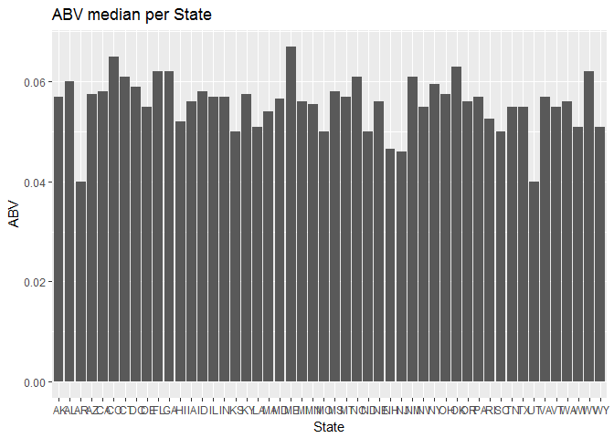
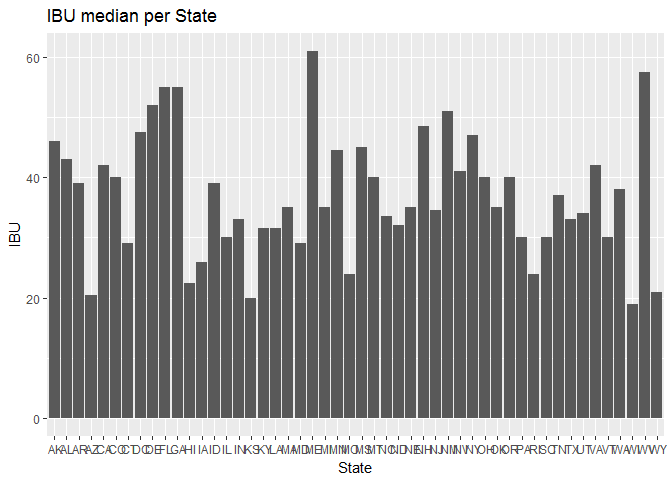
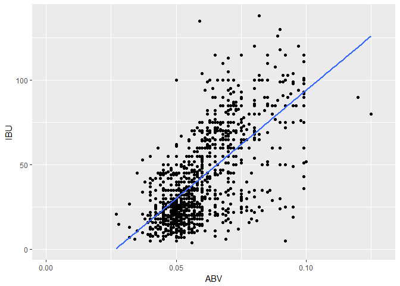

# MSDS Case Study 01, SMU
M Nepal  
June 29, 2017  


## Introduction

The case study is based on **Beers** and **Brewery** dataset provided in <a href="https://github.com/m-nepal/MSDS6306_CaseStudy01/tree/master/Data"> Data Directory</a> in the project. 
### Dataset descriptions:

##### Beers
* Name: Name of the beer.
* Beer_ID: Unique identier of the beer.
* ABV: Alcohol by volume of the beer.
* IBU: International Bitterness Units of the beer.
* Brewery_ID: Brewery id associated with the beer.
* Style: Style of the beer.
* Ounces: Ounces of beer.

##### Breweries
* Brew_ID: Unique identier of the brewery.
* Name: Name of the brewery.
* City: City where the brewery is located.
* State: State where the brewery is located.

## Required Library
Download <a href="https://cran.r-project.org/">R<a/> and <a href="https://www.rstudio.com/products/rstudio/download/">Rstudio</a> and install as you follow the code.

Once you download and install R and R studio, you need following libraries to complete the analyisis.
<ul><li><a href="http://ggplot2.org/">ggplot2<a/></li><li><a href="https://cran.r-project.org/web/packages/dplyr/index.html">dplyr<a/></li></ul>
**SessionInfo :**
R version 3.3.2 (2016-10-31)
Platform: x86_64-w64-mingw32/x64 (64-bit)
Running under: Windows >= 8 x64 (build 9200)`

## What we are trying to achieve?
This project analyses the data with some of the basic features available in **R**.There are plenty of other analyis we can conduct in <a href="https://cran.r-project.org/">R<a/>, but this project focuses on the following:
<ul>
<li>Numbers of breweries per state</li>
<li>Merging <a href="https://github.com/m-nepal/MSDS6306_CaseStudy01/tree/master/Data">**Beers** and **Brewery**<a/> data set based on common brewery_id</li>
<li>Reporting number's of NA's in each column</li>
<li>Computing median of ABV and IBU per state and plotting bar chart</li>
<li>Reporting number's of NA's in each column</li>
<li>Computing maximum alcohalic beer and most bitter beer by state</li>
<li>Finding the relation between bitterness and it's alcohalic content</li>
</ul>

### Set up

```r
# Clean up all the variables
rm(list=ls())
ls()
```

```
## character(0)
```

```r
beerDir <- "C:/Users/mohan/Desktop/MSDS6306_CaseStudy01/Data/Beers.csv"
breweryDir <- "C:/Users/mohan/Desktop/MSDS6306_CaseStudy01/Data/Breweries.csv"
#install following package and load the library simply uncommenting following code
#install.packages("ggplot2")
#install.packages("dplyr")
#library(dplyr)
#library(ggplot2)
```

### Analysis for data sets

```r
# importing data set to variables 
beers <- read.csv(beerDir, sep = ",", header = TRUE,na.strings = c("","NA"))
breweries <- read.csv(breweryDir, header = TRUE, sep=",",na.strings =c("","NA"))
# check the content of beers and breweries
head(beers)
```

```
##                  Name Beer_ID   ABV IBU Brewery_id
## 1            Pub Beer    1436 0.050  NA        409
## 2         Devil's Cup    2265 0.066  NA        178
## 3 Rise of the Phoenix    2264 0.071  NA        178
## 4            Sinister    2263 0.090  NA        178
## 5       Sex and Candy    2262 0.075  NA        178
## 6        Black Exodus    2261 0.077  NA        178
##                            Style Ounces
## 1            American Pale Lager     12
## 2        American Pale Ale (APA)     12
## 3                   American IPA     12
## 4 American Double / Imperial IPA     12
## 5                   American IPA     12
## 6                  Oatmeal Stout     12
```

```r
head(breweries)
```

```
##   Brew_ID                      Name          City State
## 1       1        NorthGate Brewing    Minneapolis    MN
## 2       2 Against the Grain Brewery    Louisville    KY
## 3       3  Jack's Abby Craft Lagers    Framingham    MA
## 4       4 Mike Hess Brewing Company     San Diego    CA
## 5       5   Fort Point Beer Company San Francisco    CA
## 6       6     COAST Brewing Company    Charleston    SC
```
#### Find numbers of breweries per state

```r
# There are different ways to find out the number of brewery per state but in this analysis following method is used
brewery_ps_way1 <- data.frame(table(breweries$State))
brewery_ps_way2 <- aggregate(rep(1, length(breweries$State)),by=list(breweries$State), sum)
# check the number of brwery per state by calling head method
head(brewery_ps_way1)
```

```
##   Var1 Freq
## 1   AK    7
## 2   AL    3
## 3   AR    2
## 4   AZ   11
## 5   CA   39
## 6   CO   47
```

```r
# In this result, Var1 represents the State and  Freq represents the number of brewery in that state
head(brewery_ps_way2)
```

```
##   Group.1  x
## 1      AK  7
## 2      AL  3
## 3      AR  2
## 4      AZ 11
## 5      CA 39
## 6      CO 47
```

```r
#in this method Group.1 column is State and x represnts the number of brewery
# Identyfying first 6 rows,  we can verify both of the method are giving the same result.
# Here dplyr package is used to give the meaningful name to coulmns header
# For presentation uncomment the library
library(dplyr)
```

```
## Warning: package 'dplyr' was built under R version 3.3.3
```

```
## 
## Attaching package: 'dplyr'
```

```
## The following objects are masked from 'package:stats':
## 
##     filter, lag
```

```
## The following objects are masked from 'package:base':
## 
##     intersect, setdiff, setequal, union
```

```r
breweriesPerState <- rename(brewery_ps_way1,State = Var1,Breweries_Count = Freq)
head(breweriesPerState)
```

```
##   State Breweries_Count
## 1    AK               7
## 2    AL               3
## 3    AR               2
## 4    AZ              11
## 5    CA              39
## 6    CO              47
```

```r
# Full list 
breweriesPerState
```

```
##    State Breweries_Count
## 1     AK               7
## 2     AL               3
## 3     AR               2
## 4     AZ              11
## 5     CA              39
## 6     CO              47
## 7     CT               8
## 8     DC               1
## 9     DE               2
## 10    FL              15
## 11    GA               7
## 12    HI               4
## 13    IA               5
## 14    ID               5
## 15    IL              18
## 16    IN              22
## 17    KS               3
## 18    KY               4
## 19    LA               5
## 20    MA              23
## 21    MD               7
## 22    ME               9
## 23    MI              32
## 24    MN              12
## 25    MO               9
## 26    MS               2
## 27    MT               9
## 28    NC              19
## 29    ND               1
## 30    NE               5
## 31    NH               3
## 32    NJ               3
## 33    NM               4
## 34    NV               2
## 35    NY              16
## 36    OH              15
## 37    OK               6
## 38    OR              29
## 39    PA              25
## 40    RI               5
## 41    SC               4
## 42    SD               1
## 43    TN               3
## 44    TX              28
## 45    UT               4
## 46    VA              16
## 47    VT              10
## 48    WA              23
## 49    WI              20
## 50    WV               1
## 51    WY               4
```
#### Merge the data set by brewery_id

```r
merged_data <- merge(beers, breweries, by.x = "Brewery_id",by.y = "Brew_ID")
dim(merged_data)
```

```
## [1] 2410   10
```

```r
# Here Beer name is listed as Name.x and Brewery name as Name.y 
# Use rename method to give some meaning full name on merged data
# use rename method from "dplyr" package
merged_new <- rename(merged_data, Beer = Name.x , Brewery = Name.y)
#printing first and last 6 obs. to check the content of  merged data
head(merged_new)
```

```
##   Brewery_id          Beer Beer_ID   ABV IBU
## 1          1  Get Together    2692 0.045  50
## 2          1 Maggie's Leap    2691 0.049  26
## 3          1    Wall's End    2690 0.048  19
## 4          1       Pumpion    2689 0.060  38
## 5          1    Stronghold    2688 0.060  25
## 6          1   Parapet ESB    2687 0.056  47
##                                 Style Ounces            Brewery
## 1                        American IPA     16 NorthGate Brewing 
## 2                  Milk / Sweet Stout     16 NorthGate Brewing 
## 3                   English Brown Ale     16 NorthGate Brewing 
## 4                         Pumpkin Ale     16 NorthGate Brewing 
## 5                     American Porter     16 NorthGate Brewing 
## 6 Extra Special / Strong Bitter (ESB)     16 NorthGate Brewing 
##          City State
## 1 Minneapolis    MN
## 2 Minneapolis    MN
## 3 Minneapolis    MN
## 4 Minneapolis    MN
## 5 Minneapolis    MN
## 6 Minneapolis    MN
```

```r
tail(merged_new)
```

```
##      Brewery_id                      Beer Beer_ID   ABV IBU
## 2405        556             Pilsner Ukiah      98 0.055  NA
## 2406        557  Heinnieweisse Weissebier      52 0.049  NA
## 2407        557           Snapperhead IPA      51 0.068  NA
## 2408        557         Moo Thunder Stout      50 0.049  NA
## 2409        557         Porkslap Pale Ale      49 0.043  NA
## 2410        558 Urban Wilderness Pale Ale      30 0.049  NA
##                        Style Ounces                       Brewery
## 2405         German Pilsener     12         Ukiah Brewing Company
## 2406              Hefeweizen     12       Butternuts Beer and Ale
## 2407            American IPA     12       Butternuts Beer and Ale
## 2408      Milk / Sweet Stout     12       Butternuts Beer and Ale
## 2409 American Pale Ale (APA)     12       Butternuts Beer and Ale
## 2410        English Pale Ale     12 Sleeping Lady Brewing Company
##               City State
## 2405         Ukiah    CA
## 2406 Garrattsville    NY
## 2407 Garrattsville    NY
## 2408 Garrattsville    NY
## 2409 Garrattsville    NY
## 2410     Anchorage    AK
```
#### Is there's any NA's?

```r
# There are different techniques that can be applied to findout missing NA's
# We can avoid blank cell to make NA's when we import as above code or we can use following code to report NA's

missing.beer <- apply(beers,2, function(x){sum(is.na(x))})
missing.brewery <- apply(breweries,2, function(x){sum(is.na(x))})
missing.merged <- apply(merged_new, 2, function(x){ sum(is.na(x))})
# another way to report missing merge
merged_2 <- replace(merged_new, merged_new == "", NA)
missing.merged_2 <- apply(merged_2, 2, function(x){ sum(is.na(x))})
# check the number's of NA's  
missing.beer
```

```
##       Name    Beer_ID        ABV        IBU Brewery_id      Style 
##          0          0         62       1005          0          5 
##     Ounces 
##          0
```

```r
missing.brewery
```

```
## Brew_ID    Name    City   State 
##       0       0       0       0
```

```r
missing.merged
```

```
## Brewery_id       Beer    Beer_ID        ABV        IBU      Style 
##          0          0          0         62       1005          5 
##     Ounces    Brewery       City      State 
##          0          0          0          0
```

```r
missing.merged_2
```

```
## Brewery_id       Beer    Beer_ID        ABV        IBU      Style 
##          0          0          0         62       1005          5 
##     Ounces    Brewery       City      State 
##          0          0          0          0
```

```r
# The NA's in beer's data set and merged data set looks similar, so we can verify the NA's numbers in data sets.
```
#### Computing median alcohal content and International bitterness unit for each state

```r
# Assign a new merged data set to a new variable for easy use for further analysis
cleanedData <- merged_2
# Check first 6 and last 6 rows just to make sure you have right data
head(cleanedData)
```

```
##   Brewery_id          Beer Beer_ID   ABV IBU
## 1          1  Get Together    2692 0.045  50
## 2          1 Maggie's Leap    2691 0.049  26
## 3          1    Wall's End    2690 0.048  19
## 4          1       Pumpion    2689 0.060  38
## 5          1    Stronghold    2688 0.060  25
## 6          1   Parapet ESB    2687 0.056  47
##                                 Style Ounces            Brewery
## 1                        American IPA     16 NorthGate Brewing 
## 2                  Milk / Sweet Stout     16 NorthGate Brewing 
## 3                   English Brown Ale     16 NorthGate Brewing 
## 4                         Pumpkin Ale     16 NorthGate Brewing 
## 5                     American Porter     16 NorthGate Brewing 
## 6 Extra Special / Strong Bitter (ESB)     16 NorthGate Brewing 
##          City State
## 1 Minneapolis    MN
## 2 Minneapolis    MN
## 3 Minneapolis    MN
## 4 Minneapolis    MN
## 5 Minneapolis    MN
## 6 Minneapolis    MN
```

```r
tail(cleanedData)
```

```
##      Brewery_id                      Beer Beer_ID   ABV IBU
## 2405        556             Pilsner Ukiah      98 0.055  NA
## 2406        557  Heinnieweisse Weissebier      52 0.049  NA
## 2407        557           Snapperhead IPA      51 0.068  NA
## 2408        557         Moo Thunder Stout      50 0.049  NA
## 2409        557         Porkslap Pale Ale      49 0.043  NA
## 2410        558 Urban Wilderness Pale Ale      30 0.049  NA
##                        Style Ounces                       Brewery
## 2405         German Pilsener     12         Ukiah Brewing Company
## 2406              Hefeweizen     12       Butternuts Beer and Ale
## 2407            American IPA     12       Butternuts Beer and Ale
## 2408      Milk / Sweet Stout     12       Butternuts Beer and Ale
## 2409 American Pale Ale (APA)     12       Butternuts Beer and Ale
## 2410        English Pale Ale     12 Sleeping Lady Brewing Company
##               City State
## 2405         Ukiah    CA
## 2406 Garrattsville    NY
## 2407 Garrattsville    NY
## 2408 Garrattsville    NY
## 2409 Garrattsville    NY
## 2410     Anchorage    AK
```

```r
#Finding median ABV and IBU per state
median_ABV_IBU <- aggregate(cbind(cleanedData$ABV,cleanedData$IBU)~State, FUN = median,cleanedData,na.rm = TRUE)
head(median_ABV_IBU)
```

```
##   State     V1   V2
## 1    AK 0.0570 46.0
## 2    AL 0.0600 43.0
## 3    AR 0.0400 39.0
## 4    AZ 0.0575 20.5
## 5    CA 0.0580 42.0
## 6    CO 0.0650 40.0
```

```r
#here ABV is named as V1 and IBU as V2, so using colnames we can rename to give meaningful name
colnames(median_ABV_IBU) <- c("State","Median_ABV","Median_IBU")
# After renaming lets' check the column header once again
head(median_ABV_IBU)
```

```
##   State Median_ABV Median_IBU
## 1    AK     0.0570       46.0
## 2    AL     0.0600       43.0
## 3    AR     0.0400       39.0
## 4    AZ     0.0575       20.5
## 5    CA     0.0580       42.0
## 6    CO     0.0650       40.0
```
Data can make more sense if we see the pattern in some visual interface.So let's plot the barchart for median ABV and IBU per state
##### Bar plot for ABV and IBU per state

```r
library(ggplot2)
```

```
## Warning: package 'ggplot2' was built under R version 3.3.3
```

```r
ggplot(median_ABV_IBU,aes(median_ABV_IBU$State, y=median_ABV_IBU$Median_ABV))+
    geom_bar(stat="identity")+labs(x="State",y="ABV") + ggtitle("ABV median per State")
```

<!-- -->

```r
ggplot(median_ABV_IBU,aes(median_ABV_IBU$State, y=median_ABV_IBU$Median_IBU))+
  geom_bar(stat="identity")+labs(x="State",y="IBU")+ggtitle("IBU median per State")
```

<!-- -->

#### What we see from the bar chart?
Comparing two bar graph, if the ABV content in the beer is increased the IBU also seems to be increasing. Most of the state has bitter beer with  ABV atleast 0.05. To summarise the bar graph, Higher the alcohalic content more the bitterness in the beer.

#### Which state has the MAX alcohalic beer and MOST bitter beer?

```r
max_ABV <- max(cleanedData$ABV,na.rm = TRUE)
max_ABV_2 <- arrange(cleanedData,desc(cleanedData$ABV))
```

```
## Warning: package 'bindrcpp' was built under R version 3.3.3
```

```r
max_ABV_3 <- head(max_ABV_2,1)
max_ABV_State <- data.frame(max_ABV_3$State,max_ABV_3$ABV)

# IBU
max_IBU <- max(cleanedData$IBU,na.rm = TRUE)
max_IBU_2 <- arrange(cleanedData,desc(cleanedData$IBU))
max_IBU_3 <- head(max_IBU_2,1)
max_IBU_State <- data.frame(max_IBU_3$State,max_IBU_3$IBU)

# let's find out which state has  the max ABV and Most bitter beer
max_ABV_State 
```

```
##   max_ABV_3.State max_ABV_3.ABV
## 1              CO         0.128
```

```r
max_IBU_State
```

```
##   max_IBU_3.State max_IBU_3.IBU
## 1              OR           138
```

```r
# CO has the maximum alcohalic beer and OR has the most bitter beer.
```
#### Summary statistics for ABV

```r
# summary statistics of ABV
summary(cleanedData$ABV)
```

```
##    Min. 1st Qu.  Median    Mean 3rd Qu.    Max.    NA's 
## 0.00100 0.05000 0.05600 0.05977 0.06700 0.12800      62
```

#### Did you find the relationship between the bitterness of the beer and it's alcohalic content?
Let's plot the scatter plot to do so.

```r
ggplot(beers, aes(x = ABV, y = IBU)) + geom_point(na.rm=TRUE)+geom_smooth(method=lm,se=FALSE, na.rm=TRUE)
```

<!-- -->

Athough there are outliers, there is positive correlation between two variables. More ABV content in beer leads more bitterness beer.

#### Conclusion
Analysing the provided data, Colorado has the most alcohalic beer and Orlando has most bitter beer. There were some NA's in the data sets.Orlando enjoys most bitter beer and  Colorado enjoys most alcohalic beer.And the scatter plot shows the positive correlation between ABV and IBU contents of beer.
The purpose of this project is to provide a hands on knowledge on some of the techniques like Data exploration, data wrangling, graphics using R. And I would say, the project has accomplished it's  purpose of it.
